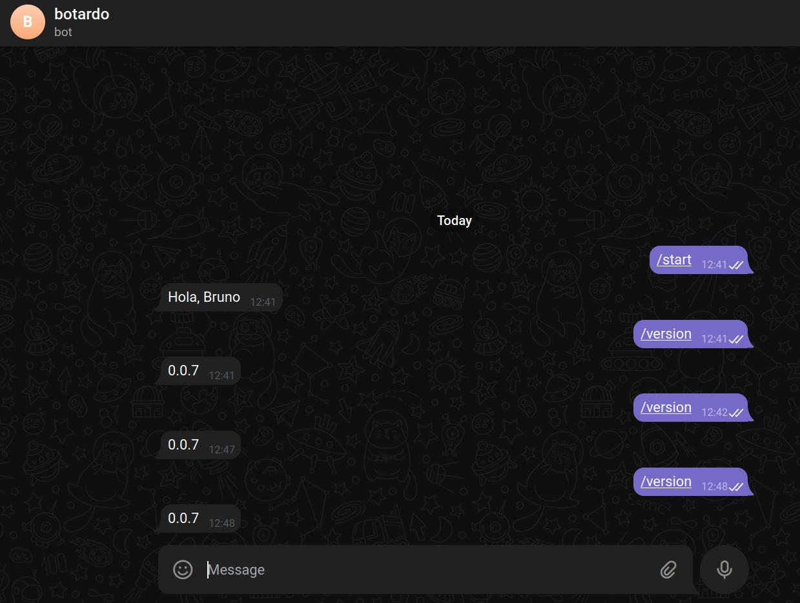

# ejercicio10

### Para levantar el deployment

`kubectl apply -f deployment.yaml`

### Se comprueba el estado del deployment

```
# kubectl get deployment botardo

NAME      READY   UP-TO-DATE   AVAILABLE   AGE
botardo   1/1     1            1           5m14s
```

# Se le pide la versión al bot



# Finalmente se destruye el deployment

`kubectl delete -f deployment.yaml`
